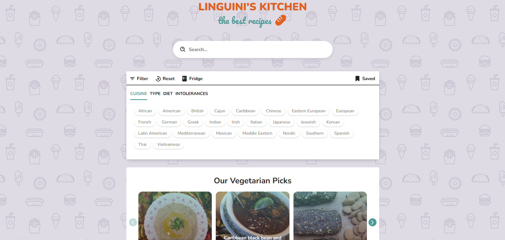

# Linguini's Kitchen

Esta SPA(Single Page Application) es un buscador de comidas personalizado. En él podras aplicar filtros dependiendo de tus gustos,intereces e intolereancias para encontrar la receta que mejor coincida con tus gustos. También podrás buscar recetas dependiendo de los ingredientes que tengas en tu heladera y guardarlas si las queres leer mas tarde.

### Tecnologías utilizadas:
- Javascript
- SASS
- HTML
- CSS

[Ver App](https://romanalvarezz.github.io/La-Scaloneta-Memory-Game/)